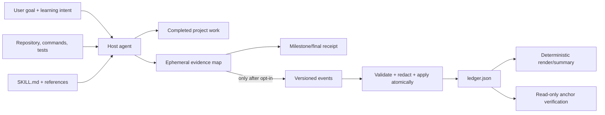

# Architecture

Project Mentor is an instruction-first Agent Skill with an optional local
reliability helper. The host agent performs semantic work; deterministic Python
code handles only strict data operations.



## Responsibilities

| Component | Responsibility | Explicit non-responsibility |
| --- | --- | --- |
| Host agent | Activation, repository inspection, concept selection, intervention timing, engineering work, evidence judgment | Must not use agent work as proof of user capability |
| `SKILL.md` | Operating workflow, mode behavior, evidence boundaries, failure behavior | Does not persist state or run code by itself |
| References | Detailed mentoring policy, ledger contract, calibration examples | Are loaded only when relevant |
| Python helper | Validation, redaction, canonical ordering, event transitions, atomic persistence, rendering, summaries, diagnostics, and explicit local anchor checks | Does not scan repositories broadly, teach, call models, access a network, or execute recorded commands |
| Repository tooling | Personal/public/plugin synchronization and official validator discovery | Is not part of the installed runtime workflow |

## Skill package

The standalone release artifact is `.agents/skills/project-mentor`; the
skills-only plugin mirrors it at `skills/project-mentor` and declares it from
`.codex-plugin/plugin.json`:

```text
project-mentor/
├── SKILL.md
├── agents/openai.yaml
├── references/
│   ├── examples.md
│   ├── ledger-schema.md
│   └── mentoring-policy.md
└── scripts/
    ├── project_mentor.py
    └── mentor_core/
        ├── anchors.py
        ├── cli.py
        ├── doctor.py
        ├── events.py
        ├── io.py
        ├── model.py
        ├── redact.py
        ├── render.py
        └── validate.py
```

The personal installation remains the canonical authoring source during the
documented release workflow. `tools/sync_skill.py` checks or writes both public
copies and requires exact release-file parity across personal, standalone, and
plugin locations.

## Semantic workflow

1. Determine whether a real project task has explicit or clearly implied
   learning intent.
2. Inspect current project evidence before explaining architecture or making
   post-hoc claims.
3. Infer `guided`, `recap`, or `hands_on`; preserve the task and evidence state
   across mode switches.
4. Classify only causally relevant concepts and surface them at meaningful
   milestones within the active interruption budget.
5. Verify the technical result before claiming completion.
6. Render a receipt that separates project evidence, agent work, and actual user
   demonstrations.
7. Persist a ledger only when the user explicitly opts in.

## Deterministic state model

The helper supports ledger schema version 1. A ledger has a session, project
metadata, concepts, milestones, decisions, event history, evidence gaps, and
deferred concepts. Every accepted event:

- has a stable ID, timestamp, actor, strict type, and strict payload;
- is redacted and validated before mutation;
- requires the caller's expected revision;
- increments the revision exactly once;
- is idempotent when the same redacted event is replayed; and
- fails closed when an event ID is reused with different content.

User demonstrations can be added only by `user` or `shared` actors. Project
evidence can move exposure to `encountered`, but it never creates a user
demonstration.

## Persistence and failure behavior

Input is UTF-8, capped at 1 MiB, and rejected on unknown fields or unsupported
versions. The helper validates and redacts a new document, writes a temporary
file in the target directory, flushes it, rechecks the expected original, and
atomically replaces the target. Existing symlink targets are refused.

`doctor` is read-only. `verify-anchors` resolves only documented relative local
locators beneath an explicit project root, refuses symlink traversal, and calls
unsupported evidence `unavailable`. Its optional write mode uses the same
revision check, event validation, redaction, and atomic replacement path as
other ledger mutations.

Expected failures map to stable exit classes: invalid input (2), revision or
content conflict (3), I/O/path safety (4), and conflicting replay (5). The prior
ledger remains unchanged. If Python or persistence is unavailable, the skill
continues with ephemeral conversation state.
